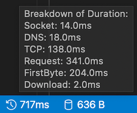
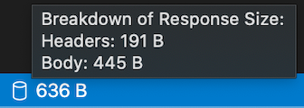

# VSCode Rest Client

## Set Up

Download the following to set up VSCode Rest Client:

- VSCode: https://code.visualstudio.com/download

- VSCode Extension Rest Client: https://marketplace.visualstudio.com/items?itemName=humao.rest-client 

- VSCode Extension GUID Insert: https://marketplace.visualstudio.com/items?itemName=heaths.vscode-guid

Open workspace, ensure Rest Client and GUID Insert are enabled on workspace. Go to `Preferences` > `Extensions`, search for the two extensions above (Rest Client & GUID) and select enable. 

<br>

## Constructing Request

- Rest Client documentation: https://marketplace.visualstudio.com/items?itemName=humao.rest-client

## Using VSCode Rest Client

### Shortcuts

<b> All shortcuts only available in http file: </b>

- Cancel Request `Cmd`+`Option`+`K`
- Send Request `Cmd`+`Option`+`R`
- Re-run Last Request `Cmd`+`Option`+`L`
- Request History `Cmd`+`Option`+`H`
- Clear History `fn`+`F1` type Rest Client: Clear Request History
- List of requests and variables `Cmd`+`Shift`+`O`
- List of environments `Cmd`+`Option`+`E`
- Open settings `Cmd`+`,`

<br>

### Environment Variables 

Environment variables are store in `settings.json` file located in `.vscode` folder. An example of how to set up file:

```http
{
    "python.pythonPath": "/usr/local/bin/python3",
    "workbench.settings.editor": "json",
    "workbench.settings.useSplitJSON": true,
    "rest-client.environmentVariables": {
        "$shared": {},
        "$sample_mhs_environment": {
            "BASE_URL": "http://localhost",
                        "INBOUND-PORT": "8082",
                        "OUTBOUND-PORT": "80",
                        "ROUTE-LOOKUP-PORT": "8088",
                        "FAKE-SPINE-PORT": "8091",
                        "ASID": "9XXXXXXXXXXX",
                        "PARTY-KEY": "A9XXXX-XXXXXXX"
        }
    }
}
```

When in selected http file, ensure at the bottom right corner the environment you wish to use is selected. As default this is set to `no environment`. In this repo a `sample-mhs-environment` has been created in the settings file, to be used as sample content. It will be listed in the environment list. `$shared` variables will be available when no environment is selected. 

Enironment variables can be used in a http file by surrounding text with curly braces and the name of variable inside `{{GUID}}`.


<br>

### File Variables

File variable are available to the file its declared in, example of format below:

```http
@baseUrl = https://example.com
```

Can be used in file as shown below in the Request Line:

```http
POST {{baseUrl}}:80 HTTP/1.1
```

<br>

### Generate UUID

Currently it is only possible to generate UUID manual using an extension. To generator new UUID, `fn` + `F1` and type `Insert GUID` where needed. Currently an environment variable is used in settings.json for this to be easily changed in all http files. 

<br>

### Response Panel 

Response panel appears when a request has been sent in a seperate panel to the right when a response returned. 

In response panel click More Actions to:
- Fold body
- Unfold body

#### Save Response

Save response, click `save` icon in response panel:
- Click the `Open` button to open the saved response file in current workspace<br>
- Click `Copy Path` to copy the saved response path to clipboard

Save response body, click `Save Response Body` button
- As default this will save according to the response MIME type, i.e. content-type: application/json, will save as json
- Overwrite the MIME type and extension mapping with below setting:
    <br>
    ```http
    "rest-client.mimeAndFileExtensionMapping": {
        "application/atom+xml": "xml"
    }
    ```

<br>

### Tips

In VSCode Explorer under `OUTLINE`, contains file and request variables for the http file currently selected. 

Hover over total duration to view duration details of Socket, DNS, TCP, First Byte and Download.



</br>
Hover over response size to view the breakdown response size details of headers and body.



<br>

## custom

### Structure

### Message examples

All messages have are locted under message file. This contains a pretty print version to enable easy reading and make ulterations where needed to the correctly formatted version listed in file. 

